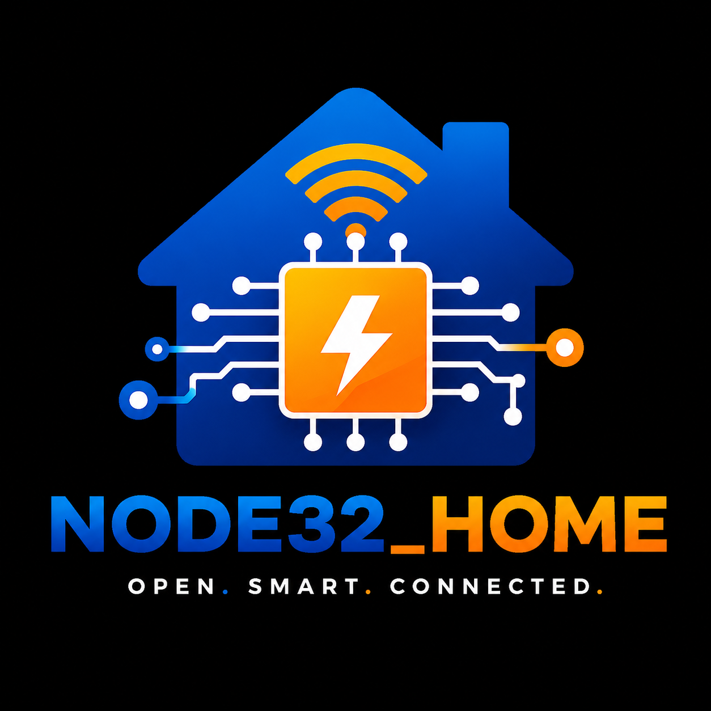

<div align="center">

<picture>
  <source media="(prefers-color-scheme: dark)" srcset="docs/images/NODE32_HOME_LOGO.png">
  <source media="(prefers-color-scheme: light)" srcset="docs/images/NODE32_HOME_LOGO.png">
  
</picture>

# ESP_HOME Ecosystem

*Open-source smart home hardware and firmware for the ESP8266 and ESP32 ecosystem.*
</br>
*THE EASYEDA FILE CAN BE FOUND IN THE FILES FOLDER*

[](LICENSE)
[](LICENSE)
[]()
[]()
[]()
[](CONTRIBUTING.md)

</div>

---

## Project Status

| Component | Status |
|----------|--------|
| NODE32_HOME Main Board V1 | Stable |
| Relay Node V1 | Stable |
| Documentation | Improving |
| Firmware | Early Development |
| Desktop Software | Planned |
| Web Dashboard | Planned |
| Mobile App | Planned |

---

## Introduction

**ESP_HOME** is an open-source smart home ecosystem centered around **NODE32_HOME**, a modular controller board built on the ESP8266 platform. Alongside companion hardware like the Relay Node V1, the ecosystem is designed for reliability, modularity, and community-driven development.

### Why This Project Exists

Many smart home solutions are closed, cloud-dependent, or designed as single-purpose devices. ESP_HOME was created to offer a fully open alternative where every layer — from PCB layout to firmware to user interface — is transparent, modifiable, and owned by the community.

The goal is not to compete with commercial products on feature count, but to provide a foundation that engineers, hobbyists, and researchers can trust, extend, and build upon for years.

### Project Philosophy

Open-source hardware matters because hardware locks us into decisions in a way that software does not. A closed PCB cannot be forked. A proprietary BOM cannot be sourced competitively. ESP_HOME is committed to:

- **Transparency** — Every design decision is documented and justified
- **Repairability** — Standard components, accessible layouts, open files
- **Longevity** — Designs that can be manufactured years from now without dependency on a single vendor
- **Community** — The ecosystem improves when more people can inspect, modify, and contribute

---

## Features

- **Modular Hardware** — Central controller board plus interchangeable node types (relay, sensor, dimmer, and more)
- **Offline-First Communication** — ESP-NOW protocol for low-latency, peer-to-peer operation without cloud dependency
- **Fully Open Source** — Hardware licensed under CERN-OHL-S v2, software under MIT
- **Expandable Architecture** — Add nodes without redesigning the system
- **Professionally Documented** — Schematics, BOM, technical references, and architectural documentation included

---

## Hardware Overview

### Current Boards

| Board | Status | Description |
|-------|--------|-------------|
| [NODE32_HOME Main Board V1](hardware/NODE32_HOME_MAINBOARD_V1/) | Stable | Central controller based on ESP8266 with expansion headers |
| [Relay Node V1](hardware/RELAY_NODE_V1/) | Stable | Companion relay output board for load control |

### Planned Hardware

- Sensor nodes
- DIN rail controllers
- Power monitoring modules
- Smart switch modules
- Display modules
- Expansion boards
- Development boards

---

## Repository Structure

```
/
├── .github/                # Issue templates, PR template, CODEOWNERS
├── docs/                   # Documentation
│   ├── images/             # Logos, diagrams, flowcharts
│   ├── hardware/           # Per-board hardware documentation
│   ├── firmware/           # Firmware architecture and API docs
│   └── software/           # Software documentation (planned)
├── hardware/               # PCB design files
│   ├── NODE32_HOME_MAINBOARD_V1/   # Schematics, BOM, manufacturing
│   └── RELAY_NODE_V1/              # Relay node design files
├── firmware/               # PlatformIO firmware sources
│   ├── mainboard/          # Main controller firmware
│   └── relay_node/         # Relay node firmware
├── software/               # Desktop, web, and mobile applications (planned)
├── examples/               # Usage examples
├── tools/                  # Flashing scripts, calibration tools
└── manufacturing/          # Assembly guides, testing procedures
```

---

## Quick Start

### Prerequisites

- [PlatformIO](https://platformio.org/) CLI or VS Code extension
- Git

### Clone

```bash
git clone https://github.com/Nitheesh-NR-Labs/NODE32_HOME.git
cd NODE32_HOME
```

### Build Firmware

```bash
# Main controller
cd firmware/mainboard
pio run

# Relay node
cd ../relay_node
pio run
```

### Upload

```bash
pio run --target upload
```

---

## Roadmap

| Area | Status |
|------|--------|
| NODE32_HOME Main Board V1 | Complete |
| Relay Node V1 | Complete |
| Firmware — WiFi Provisioning | Planned |
| Firmware — OTA Updates | Planned |
| Firmware — MQTT Support | Planned |
| Firmware — Matter Support | Planned |
| Software — Device Manager | Planned |
| Software — Web Dashboard | Planned |
| Software — Desktop Flasher | Planned |
| Documentation — Tutorials | Planned |
| Documentation — API Docs | Planned |

See [ROADMAP.md](ROADMAP.md) for the full project roadmap.

---

## Looking for Contributors

ESP_HOME is a community-driven project and welcomes contributors at every experience level. Whether you are new to embedded systems or an experienced engineer, there is a place for you.

Areas where help is especially valuable:

- **PCB Design** — Review layouts, suggest improvements, design new nodes
- **Firmware Development** — Implement WiFi provisioning, OTA, MQTT, and drivers
- **Software Development** — Build desktop tools, web dashboards, and mobile apps
- **Documentation** — Write tutorials, API references, and assembly guides
- **Testing** — Build boards, validate functionality, report issues

See [CONTRIBUTING.md](CONTRIBUTING.md) for detailed guidelines.

---

## License

This project uses a dual-licensing model:

| Component | License |
|-----------|---------|
| Hardware designs (PCB, schematics, BOM) | [CERN Open Hardware License v2 — Strongly Reciprocal](LICENSE) |
| Firmware, software, and documentation | [MIT License](LICENSE) |

The CERN-OHL-S v2 ensures that hardware improvements remain open. The MIT license provides maximum flexibility for software and documentation.

---

## Community

- [GitHub Issues](https://github.com/Nitheesh-NR-Labs/NODE32_HOME/issues) — Bug reports, feature requests
- [Pull Requests](https://github.com/Nitheesh-NR-Labs/NODE32_HOME/pulls) — Contributions
- [Discussions](https://github.com/Nitheesh-NR-Labs/NODE32_HOME/discussions) — Questions, ideas, community support

---

## Maintainer

**Nitheesh NR Labs** — Project maintainer and original author.

For questions or collaboration inquiries, please open a [Discussion](https://github.com/Nitheesh-NR-Labs/NODE32_HOME/discussions).

---

<p align="center">
  <sub>Built with care by the ESP_HOME community.</sub>
</p>
